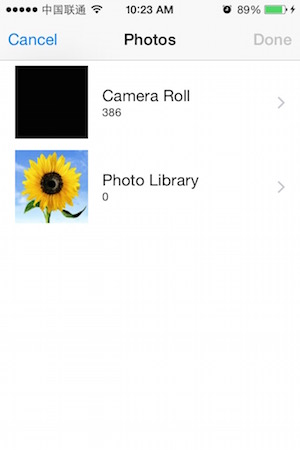
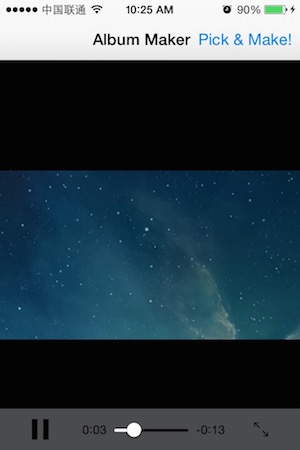

# WSDynamicAlbumMaker
An easy-to-use utility for merging photos to into a video, written in Swift.

----
* Support iOS 8, Swift 1.2, xCode6.3.
* Singleton pattern, just few lines of code for using.
* Can compose Photos into a video file with a background music.
* Customized CALayer Animation can been exported into a video file.

##Usage
Create your own CAAnimation, and pass it to *WSDynamicAlbumMaker*.

```
let videoURL = NSURL.fileURLWithPath(NSBundle.mainBundle().pathForResource("BaseVideo", ofType: "m4v")!)    //  1
let audioURL = NSURL.fileURLWithPath(NSBundle.mainBundle().pathForResource("music", ofType: "mp3")!)        // *2 

let renderLayerSize = WSDynamicAlbumMaker.sharedInstance.querySizeWithAssetURL(videoURL: videoURL!)         // *3
let albumLayer = createSequenceAlbumCALayer(renderLayerSize)                                                //  4
let duration = 10                                                                                           //  5

WSDynamicAlbumMaker.sharedInstance.createDynamicAlbum(videoURL: videoURL!, renderLayer: albumLayer, duration: duration, completionBlock: { (url, error) -> Void in
    if let err = error {
        // error accured during exporting
    } else {
    	// export DONE!
    	// you can do more with the *url*
    	playVideo(url!)
    }
	return
})
```
#### In the Code :
1. Prepare a *1s-length-video*, just used as a **canvas** to draw CAAnimations on, so really don't care about the video's content. 
2. Choose the background music. (also you can ignore it, to create a silent video)
3. Ask **WSDynamicAlbumMaker** for the size of the rendering video which you create in **setp 1**, and you can make your animation based on the **Size**.
4. Create a **CALayer instance**, with all animation setted up, this **CALayer instance** will be persistented into a video file.
5. Point out the Animation's duration.
6. Go create the Dynamic Album, **WSDynamicAlbumMaker** will generate a video with the content of the **animations** in the **CALayer instance** .

**About more pleace checkout the Demo.**

----

##Demo Project Screenshot

#####1.Startup screen


#####2.Pick photos


#####3.Generating video


#####4.Done and play the video


